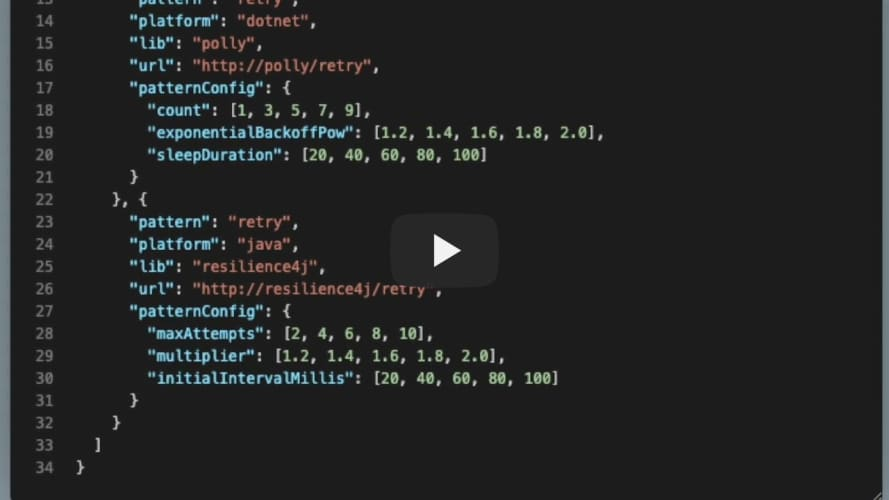

# ResilienceBench: A Resiliency Pattern Benchmark

ResilienceBench is a language-agnostic benchmark environment to support the experimental evaluation of microservice resiliency patterns, such as [Retry](https://docs.microsoft.com/en-us/azure/architecture/patterns/retry) and [Circuit Breaker](https://docs.microsoft.com/en-us/azure/architecture/patterns/circuit-breaker), implemented by popular open source resilience libraries, such as C\#'s [Polly](https://github.com/App-vNext/Polly) and Java's [Resiliency4](https://github.com/resilience4j/resilience4j).

Jump to:

* [Documentation](/docs)

* [Installation](#installation)

* [Demo video](#demo-video)

* [Publications](#publications)

## Installation

### Requirements

Docker 20.10+ and Docker Compose 1.29+.

### Setup

First, clone the ResilienceBench project repository from [GitHub](https://github.com/ppgia-unifor/resiliency-pattern-benchmark).

```sh
git clone git@github.com:ppgia-unifor/resiliency-pattern-benchmark.git
cd resiliency-pattern-benchmark
```

Then, build the ResilienceBench Docker images by calling Docker Compose `build`.

```sh
docker-compose build
```

### Configuration

Start by copying one of the sample test configuration files (e.g., `config-retry.json`) provided in the [samples](/samples) folder and rename it (e.g., `my-test.json`).

```sh
cp ./samples/config-retry.json ./my-config.json
```

Change the control and resilience parameters of the new configuration file as needed (see the parameters description in the [documentation folder](/docs/README.md#test-scenarios)).

Edit the left-hand-side of the `volumes` attribute of the `scheduler` service in ResilienceBench's `docker-compose.yaml` file to refer to the new configuration file.

```yaml
volumes:
  - ./my-config.json:/opt/app/conf/conf.json
```

Specify where the test results should be stored. 

Two storage options are currently supported: in the AWS S3 cloud storage service, or in the local file system. Both options can be configured by defining appropriate environment variables in the `environment` section of the `scheduler` service in the `docker-compose.yaml` file.

#### AWS S3

1. Create the AWS credentials file and store it in the host machine by following the steps described [here](https://docs.aws.amazon.com/cli/latest/userguide/cli-configure-files.html).
2. Edit the `volume` section of the `scheduler` service in the `docker-compose.yaml` file to refer to the AWS credentials file.

    ```yaml
    volumes:
      - /home/vagrant/.aws/credentials:/root/.aws/credentials
    ```

3. Specify the name (e.g., `my-bucket`) and path (e.g., `results-folder`) of the AWS S3 bucket where the tests results will be stored by defining the `AWS_BUCKET_NAME` and `AWS_OUTPUT_PATH` variables in the `enviroment` section of the the `scheduler` service.

    ```yaml
    environment:
      - AWS_BUCKET_NAME=my-bucket
      - AWS_OUTPUT_PATH=results-folder

#### Local file system

1. Make sure the `AWS_BUCKET_NAME` and `AWS_OUTPUT_PATH` variables are not defined.
2. Specify the path to a local folder inside the `scheduler` service container where the tests results will be stored (e.g., `/opt/app/resilience-tests`) by defining the `DISK_PATH` variable in the `enviroment` section of the `scheduler` service.
3. Edit the `volumes` section of the `scheduler` service to map the selected local folder inside the `scheduler` service container to a local folder in the host machine (e.g., `./results`).
    
    ```yaml
    environment:
      - DISK_PATH=/opt/app/resilience-tests
    volumes:
      - ./results:/opt/app/resilience-tests
    ```

### Execution

Finally, execute the test scenarios specified in the input configuration file by calling Docker Compose `up`.

```sh
docker-compose up
```

After all test scenarios have been executed, the test results will be stored as a set of CSV files in the location chosen by the user. See the [documentation](/docs/README.md#test-results) for a description of the CSV files schema and contents. 

## Demo video

[](https://www.youtube.com/watch?v=X7nzlK86eAo "ResilienceBench Demo Video")

## Publications

Costa, T. M., Vasconcelos, D. M., Aderaldo, C. M., and Mendonça, N. C. (2022). **Avaliação de Desempenho de Dois Padrões de Resiliência para Microsserviços: Retry e Circuit Breaker.** In 40th Brazilian Symposium on Computer Networks and Distributed Systems (SBRC 2022). Accepted for publication. The experimental dataset used in the work described in this paper is available in the folder [data/sbrc2022](data/sbrc2022/).
