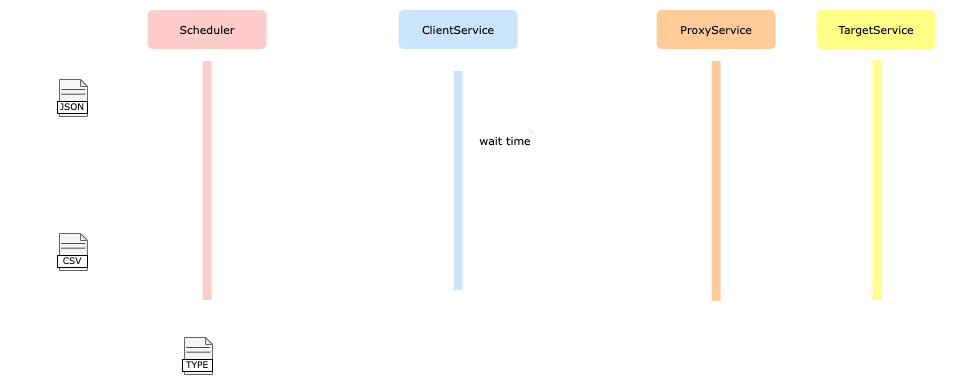

# ResilienceBench: A Resiliency Pattern Benchmark

ResilienceBench is a language-agnostic benchmark environment to support the experimental evaluation of microservice resiliency patterns, such as [Retry](https://docs.microsoft.com/en-us/azure/architecture/patterns/retry) and [Circuit Breaker](https://docs.microsoft.com/en-us/azure/architecture/patterns/circuit-breaker), implemented by popular open source resilience libraries, such as C\#'s [Polly](https://github.com/App-vNext/Polly) and Java's [Resiliency4](https://github.com/resilience4j/resilience4j).

## Architecture

The ResilienceBench architecture contains four main components: a **scheduler**, a **client service**, a **proxy service**, and a **target service**, which interact at run time as depicted in the figure below. 

<br/><br/>

<br/><br/>

The scheduler (i) parses and executes the set of resilience test scenarios specified by the ResilienceBench user in a [JSON input file](#scenarios-input-file); (ii) invokes the client service with the test parameters for each scenario; and (iii) collects the test results received from the client service and returns them to the user in a [CSV output file](#results-output-file).  

The client service (i) invokes the target service using a given resilience pattern (e.g., Retry), as specified in the test scenario being executed; (ii) collects and calculates a set of performance and resilience metrics (e.g., mean response timefrom the result of each target service invocation; and (iii) returns the collected performance metrics to the scheduler.

The proxy service transparently injects a given type of failure (e.g., abort or delay failures) into the target service invocation flow, according to a given failure rate.

Finally, the target service simply processess and responds to the client service's requests.

## Test scenarios (input file)

ResilienceBench test scenarios consist of a set of test parameters specified as a JSON file. The JSON code below shows an example of a test scenario:

```json
{
    "testId": "MyTest",
    "concurrentUsers": [25],
    "rounds": 10,
    "maxRequestsAllowed": 100,
    "targetSuccessfulRequests": 25,
    "fault": {
        "type": "abort",
        "percentage": [50],
        "status": 503
    },
    "patterns": [
        {
            "pattern": "retry",
            "platform": "java",
            "lib": "resilience4j",
            "url": "http://resilience4j/retry",
            "patternConfig": {
                "maxAttempts": 6,
                "multiplier": 1.5,
                "intervalFunction": "EXPONENTIAL_BACKOFF",
                "initialIntervalMillis": [100]
            }
        }
    ]
}
```
The test scenario parameters are grouped into two categories: **control parameters**, and **resilience parameters**.

### Control parameters

These are parameters used to control the test scenarios execution. 

| Parameter | Type | Required | Description |
| :--- | :--- | :--- | :--- |
| testId | `string` | no | The test identifier. If not defined, a test identifier will be automatically generated containing the date and time of the test execution. The test identifier is used as the name of the CSV file to be generated containing the test results. |
| concurrentUsers | `array of numbers` |  yes | Array containing the numbers of instances of the client service that will concurrently invoke the target service during each scenario execution. Each element of the array represents a different test scenario. |
| rounds | `number` | yes | Number of executions of each scenario. |
| targetSuccessfulRequests | `number` | yes | Expected number of successful invocations of the target service by the client service. |
| maxRequestsAllowed | `number` | yes | Maximum number of (either successful or unsuccessful) invocations of the target service by the client service. |
| fault | `faultSpec` | yes | Specification of the failure type to be injected by the proxy service into the target service invocation flow. See the faultSpec scheme below |

The latter parameter is useful to prevent the client application from never reaching the required number of successful invocations in a reasonable window of time, which may happen under high server failure rates.

#### FaultSpec scheme

| Parameter | Type | Required | Description |
| :--- | :--- | :--- | :--- |
| type | `string` | yes | Type of failure to be injected. Currently supported types: *delay* and *abort*. |
| percentage | `array of numbers` | yes | Array containing the percentages of failures to be injected by the proxy service into the target service invocation flow. Each element of the array represents a different test scenario. 
| duration | `number` | no | Duration (in miliseconds) of the delay failures to injected by the proxy service. Required when type is *delay*. |
| status | `number` | no | HTTP status code to be returned by the proxy service to the client service upon each failed invocation. Required when type is *abort*. |


### Resilience parameters

Resilience strategy the client application will use to invoke the target service. It's an array where is possible to define several clients and their patterns. Each pattern (e.g: retry or circuit breaker) is one object in this array. To group them in the result dataset, use `lib` and `platform` properties. 

| Parameter | Type | Required | Description |
| :--- | :--- | :--- | :--- |
| pattern | `string` | yes | The name of pattern. |
| platform | `string` | yes | The name of plataform. |
| lib | `string` | yes | The name of library. |
| url | `string` | yes | The url that process the tasks wrapped in pattern |
| configTemplate | `object` | yes | The library's pattern configuration. It's a dynamic object and the value will be processed and passed to the `url`. |


[Architecture](#architecture)

[Getting started](#getting-started)

[Scenarios (input file)](#scenarios-input-file)

[Results (output file)](#results-output-file)

[Storage configuration](#storage-configuration)

[Publications](#publications)

## Architecture

**Scheduler** sets up the scenarios and initiates the processing by spawning threads to request configured clients. When threads end up, it aggregates the metrics and generates tests results.

**Client** implements an HTTP client wrapped by resilience patterns. It should reach a predefined number of successful requests, and measure its performance on this task.

**Target** implements the application to be the target of the tested client. This component is a joint of [Httpbin](http://httpbin.org), representing the target service and, [Envoy](https://www.envoyproxy.io) acting as a proxy service, enabling fault injection (e.g., server errors and response delays).


## Installation and usage instructions

### Requirements

Docker 20.10+ and Docker Compose 1.29+.

### Clone and build

First, clone the benchmarl repository.

```sh
git clone git@github.com:ppgia-unifor/resiliency-pattern-benchmark.git
cd resiliency-pattern-benchmark
```

Then, build the benchmark components.

```sh
docker-compose build
```

The command above will pull third-party images and build the images of the benchmark's native components.

### Configure and execute

Start by copying one of the sample test scenario specifications (e.g., config-retry.json) provided in the [samples](/samples) folder.

```sh
cp ./samples/config-retry.json ./config-my-scenario.json
```

Change the new scenario specification's control and resilience parameters as needed (see the test scenario's [parameters description](#scenarios-input-file)).

Edit the left-hand-side of the `volumes` atribute of the `scheduler` service in the benchmark's `docker-compose.yaml` file to refer to the new scenario specification.

```yaml
volumes:
  - ./config-my-scenario.json:/opt/app/conf/conf.json
```

Specify where the test results should be stored. 

Two storage options are currently supported: in the local file system or in the AWS cloud. Both options can be configured by defining appropriate environment variables in the `environment` attribute of the `scheduler` service in the benchmark's  `docker-compose.yaml` file.


It supports two strategies to save the results dataset: remote and local. The remote strategy use Amazon S3. Open `docker-compose.yaml` file and find the definition of `scheduler` container, in the `environment`

#### Remote (Amazon S3) configuration

1. Configure the AWS credentials file on host machine by follow the steps available [here](https://docs.aws.amazon.com/cli/latest/userguide/cli-configure-files.html).
2. Mount the credentials file to the container by editing the section `volume` in service `scheduler` in the file `docker-compose.yaml`

    ```yaml
    volumes:
      - /home/vagrant/.aws/credentials:/root/.aws/credentials
    ```

3. Set the bucket name to `AWS_BUCKET_NAME` variable.
4. Set the path inside the bucket to `AWS_OUTPUT_PATH` variable.
5. Make sure the variable `DISK_PATH` do not exist.


#### Local configuration

1. Make sure `AWS_BUCKET_NAME` and `AWS_OUTPUT_PATH` do not exist;
2. Set `DISK_PATH` to a path inside the container;
3. Mount a volume binding `DISK_PATH` and a path in the host;
    
    ```yaml
    environment:
      - DISK_PATH=/opt/app/resilience-tests
    volumes:
      - ./results:/opt/app/resilience-tests
    ```


Finally, execute the test scenarios by calling Docker Compose up.


```sh
docker-compose up
```


## Results (output file)

Description ...

<table>
    <thead>
        <tr>
            <th>Parameter</th>
            <th>Type</th>
            <th>Description</th>
        </tr>
    </thead>
    <tbody>
        <tr>
            <td>totalCalls</td>
            <td><code>number</code></td>
            <td>number of total invocations of the target service by the client application</td>
        </tr>
        <tr>
            <td>successfulCalls</td>
            <td><code>number</code></td>
            <td rowspan=2>segmented number of successful and unsuccessful invocations of the target service by the client application</td>
        </tr>
        <tr>
            <td>unsuccessfulCalls</td>
            <td><code>number</code></td>
        </tr>
        <tr>
            <td>totalRequests</td>
            <td><code>number</code></td>
            <td>number of total requests of the target service by the client application, including the retries</td>
        </tr>
        <tr>
            <td>successfulRequests</td>
            <td><code>number</code></td>
            <td rowspan=2>segmented number of successful and unsuccessful requests of the target service by the client application, including the retries</td>
        </tr>
        <tr>
            <td>unsuccessfulRequests</td>
            <td><code>number</code></td>
        </tr>
        <tr>
            <td>successTime</td>
            <td><code>number</code></td>
            <td></td>
        </tr>
        <tr>
            <td>successTimePerRequest</td>
            <td><code>number</code></td>
            <td></td>
        </tr>
        <tr>
            <td>errorTime</td>
            <td><code>number</code></td>
            <td></td>
        </tr>
         <tr>
            <td>errorTimePerRequest</td>
            <td><code>number</code></td>
            <td></td>
        </tr>
        <tr>
            <td>totalContentionTime</td>
            <td><code>number</code></td>
            <td>Total execution time spent waiting for either a successful or an unsuccessful response from the target service</td>
        </tr>
        <tr>
            <td>contentionRate</td>
            <td><code>number</code></td>
            <td>Fraction of the client application's total execution time spent waiting for either a successful or an unsuccessful response from the target service</td>
        </tr>
        <tr>
            <td>throughput</td>
            <td><code>number</code></td>
            <td>Requests per seconds sent to target service by client service</td>
        </tr>
        <tr>
            <td>userId</td>
            <td><code>number</code></td>
            <td>Unique identifier of the virtual user</td>
        </tr>
        <tr>
            <td>startTime</td>
            <td><code>timestamp</code></td>
            <td rowspan=2>Time when the client service start/end sending requests to target service</td>
        </tr>
        <tr>
            <td>endTime</td>
            <td><code>timestamp</code></td>
        </tr>
        <tr>
            <td>users</td>
            <td><code>number</code></td>
            <td>Virtual users simulated in this round</td>
        </tr>
        <tr>
            <td>round</td>
            <td><code>number</code></td>
            <td>Current round of the test</td>
        </tr>
        <tr>
            <td>lib</td>
            <td><code>string</code></td>
            <td>The library name</td>
        </tr>
        <tr>
            <td>pattern</td>
            <td><code>string</code></td>
            <td>The pattern name</td>
        </tr>
        <tr>
            <td>faultPercentage</td>
            <td><code>number</code></td>
            <td>Rate of failure which was injected into the request stream</td>
        </tr>
        <tr>
            <td>faultType</td>
            <td><code>string</code></td>
            <td>Type of failure which was injected into the request stream</td>
        </tr>
        <tr>
            <td>faultStatus</td>
            <td><code>number</code></td>
            <td>HTTP status code sent when the request failed</td>
        </tr>
    </tbody>
</table>


## Publications

Costa, T. M. et al. (2022). **Avaliação de Desempenho de Dois Padrões de Resiliência para Microsserviços: Retry e Circuit Breaker.** In XL Simpósio Brasileiro de Redes de
Computadores e Sistemas Distribuídos (SBRC). Aceito para publicação.

- The experimental dataset used is available in the folder [sbrc2022-data](sbrc2022-data/).

