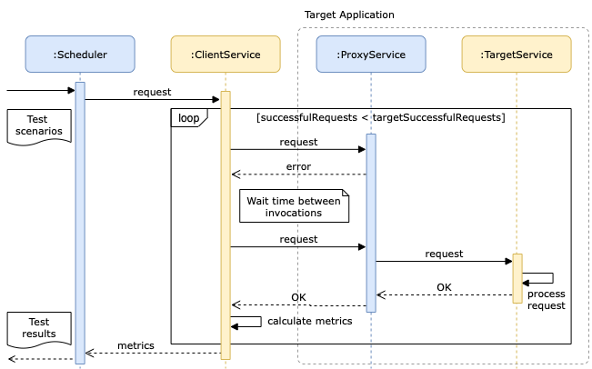

# Resiliency Parterns Benchmark
A benchmark to evaluate resiliency patterns implemented in multiple programming languages.

## Architecture



* **Scheduler** sets up the scenarios and initiates the processing by spawning threads to request configured clients. When threads end up, it aggregates the metrics and generates tests results.

* **Client** implements an HTTP client wrapped by resilience patterns. It should reach a predefined number of successful requests, and measure its performance on this task.

* **Proxy** acts controlling the communication between the clients and the target service. It

* **Target** represents a ...

## Getting Started

This benchmark runs on top of a virtual machine managed by [Vagrant](https://www.vagrantup.com). 


1. Download and install [Vagrant](https://www.vagrantup.com/docs/installation).

2. Sets up the virtual machine by running `vagrant up` in the root folder.

3. The tests will start as soon as the virtual machine ends up its provision. To configure a custom test, see the next section.

## Setting up a custom test

- describe json properties
- describe each component
- describe docker-compose file

fault types: abort and delay

| Parameter | Type | Description |
| :--- | :--- | :--- |
| `type` | `string` | **Required**. accept delay or fault |
| `percentage` | `array` | **Required**.  ... |
| `duration` | `number` | **Required**. ... |
| `status` | `number` | **Optional**.  |

Samples:

* Delay fault
```json
"fault": {
    "type": "delay",
    "percentage": [0, 25, 50, 75],
    "duration": 1000, 
    "status": 503 
}
```

* Abort fault

```json
"fault": {
    "type": "abort",
    "percentage": [0, 25, 50, 75],
    "duration": 1000, 
    "status": 503 
}
```
## Adding a new programming language

A client should follow a very simple contract to be integrated into this benchmark. 

**Requirements**

types: technical / conceptual

- (conceptual) should offer a baseline version of it, that is a version of the operation with no pattern wrapping it;

- (conceptual) should calculate its own metrics;

- should accept timeout configuration via env variable;

- should accept host and resource via env variable;

- (technical) should be containerized using Docker. The container should be multi-stage in order to build itself without the need to install dependencies in host machine. (https://docs.docker.com/develop/develop-images/multistage-build/)[Click here] to learn about multi-stage build.

- The request body should accept this payload. 
```json
{
    "maxRequestsAllowed": 1,
    "targetSuccessfulRequests": 1,
    "params": {}
}
```

- The response boby should follow this format:

```json
{

}
```

